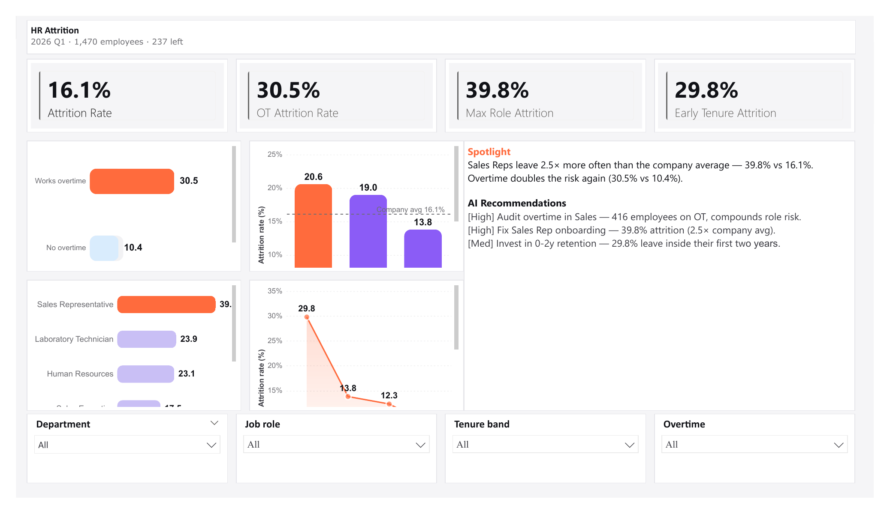

# HR Employee Attrition Dashboard

## Overview
A people-analytics dashboard built in Power BI and Vega-Lite that analyses 1,470 employee records to identify who is at risk of leaving and why. Surfaces three concrete retention levers — overtime, role, and early tenure — that explain most of the attrition signal.

## Dashboard Preview

Live interactive version (filters actually work): [dashboard-interactive.html](dashboard-interactive.html)

## Key Insights
- **Overtime is a 2.9× risk multiplier.** 30.5% of overtime employees leave vs 10.4% of non-OT employees. 416 workers are in this bucket.
- **Sales Representatives leave at 2.5× the company average.** 39.8% annual attrition vs 16.1% overall — the single hottest seat in the company.
- **Attrition is front-loaded.** 29.8% of employees leave inside their first 2 years; only 8.1% of 10+ year veterans leave. A 3.7× gap.

## KPIs
| KPI | Value |
|-----|-------|
| Overall Attrition Rate | 16.1% |
| OT Attrition Rate | 30.5% |
| Max Role Attrition (Sales Rep) | 39.8% |
| Early Tenure Attrition (0-2 y) | 29.8% |

All four values independently verified by Agent 5 against raw `data.csv` using awk.

## Tools & Tech
- Power BI Desktop v2.152.1279.0 (PBIP text format)
- Deneb custom visual (Vega-Lite v5) for all 4 charts
- TMDL semantic model with 8 DAX measures + 1 calculated column
- Claude (AI-assisted 6-agent pipeline)

## Dataset
IBM HR Analytics Employee Attrition — public Kaggle dataset, CC0 license, 1,470 rows × 35 columns.

## Pipeline
1. **Agent 1 — Strategist:** researches KPIs from HR domain knowledge
2. **Agent 2 — Profiler:** data quality check, flags flat distributions
3. **Agent 3 — Designer:** produces design-spec.md + background image
4. **Agent 4 — Builder:** writes Vega-Lite chart JSONs + Power BI theme
5. **Manual Power BI step (~3 min):** slicer bindings + apply theme
6. **Agent 5 — QA:** independently re-aggregates every KPI from source
7. **Agent 6 — Publisher:** assembles this portfolio page + README

## Files
| File | Description |
|------|-------------|
| `portfolio-page.html` | Public portfolio case study |
| `README.md` | This file |
| `dashboard-interactive.html` | Fully interactive version with working filters |
| `screenshots/dashboard-final.png` | Static dashboard export |

## Author
Rayyan Junaid — Data Analyst
[LinkedIn](http://linkedin.com/in/rayyanjunaid)
